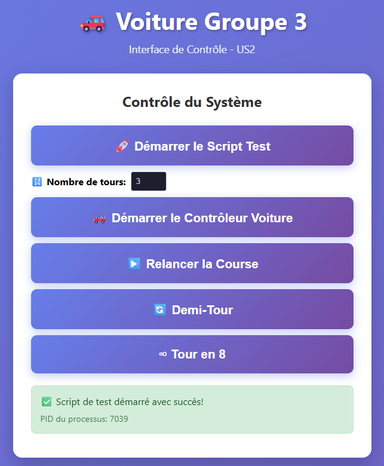

# Projet Voiture - Gestion Projet G3 2025/2026

## 📋 Description

Projet de gestion et contrôle d'un **véhicule autonome** doté d'un système complet de capteurs et d'actionneurs. Le véhicule est capable de :
- 🚗 Se déplacer de manière autonome
- 🎯 Suivre des trajectoires complexes (tours en 8, demi-tours)
- 📍 Détecter les obstacles et éviter les collisions
- 🏁 S'arrêter avec précision à une ligne d'arrivée
- 🌐 Être contrôlé via une interface web

Le projet est construit autour d'une **architecture modulaire** avec séparation claire entre la logique métier, l'accès au matériel et l'interface utilisateur.

---

## 🏗️ Architecture du Projet

### Structure des Répertoires

```
Projet Voiture/
├── README.md                          # Ce fichier
├── documents/                         # Documentation technique
│   ├── Docs.md                       # Documentation architecture matérielle
│   └── UML_classes.puml              # Diagrammes UML des classes
├── src/                              # Code source principal
│   ├── controllers/                  # Logique de contrôle
│   │   ├── ControleurVoiture.py     # Contrôleur principal
│   │   └── GestionSecurite.py       # Gestion des sécurités
│   ├── materiel/                     # Interfaces matériel
│   │   ├── actionneurs/              # Moteurs et servos
│   │   │   ├── PiloteMoteur_L298N.py
│   │   │   └── PiloteServo_PCA9685.py
│   │   ├── capteurs/                 # Détecteurs et capteurs
│   │   │   ├── CapteurCouleur.py
│   │   │   ├── CapteurUltrason.py
│   │   │   └── DetecteurLigneArrivee_IR.py
│   │   └── energie/                  # Gestion énergie et telémétrie
│   │       └── Telemetrie_INA219.py
│   ├── models/                       # Modèles de données
│   │   ├── SystemData.py            # Modèle central de données
│   │   ├── logs/                    # Répertoire des logs
│   │   └── sensors.json             # Données capteurs
│   └── views/                        # Interface web
│       ├── web_server.py            # Serveur Flask
│       ├── static/
│       │   └── style.css            # Styles CSS
│       └── templates/
│           └── index.html           # Page d'accueil
└── tests/                            # Suite de tests
    ├── test_controllers/            # Tests contrôleurs
    ├── test_materiel/               # Tests matériel
    │   ├── test_CapteurCouleur.py
    │   ├── test_DetecteurLigneArrivee.py
    │   ├── test_PiloteMoteur.py
    │   ├── test_PiloteServo.py
    │   ├── test_Telemetrie.py
    │   └── test_Ultrason_HCSR04.py
    ├── test_models/                 # Tests modèles
    │   └── test_SystemData.py
    ├── demi_tour.py                 # Script test demi-tour
    ├── reset_servo.py               # Script reset servos
    ├── Script_avant_course.py        # Script initialisation
    └── Script_tour_en_8.py          # Script tour en 8
```

---

## 🔧 Composants Matériels et Logiciels

### 👁️ Capteurs (Acquisition de Données)

| Composant | Module | Fonction |
|-----------|--------|----------|
| **Ultrason HC-SR04** | `CapteurUltrason.py` | Mesure de distance (détection obstacles) |
| **Détecteur IR** | `DetecteurLigneArrivee_IR.py` | Détection ligne d'arrivée |
| **Capteur Couleur TCS3472** | `CapteurCouleur.py` | Reconnaissance couleurs et signaux |

### 💪 Actionneurs (Génération de Mouvement)

| Composant | Module | Fonction |
|-----------|--------|----------|
| **Moteur DC L298N** | `PiloteMoteur_L298N.py` | Propulsion (avant/arrière, accélération) |
| **Servomoteur PCA9685** | `PiloteServo_PCA9685.py` | Direction et articulation précise |

### ⚡ Énergie et Télémétrie

| Composant | Module | Fonction |
|-----------|--------|----------|
| **Sonde INA219** | `Telemetrie_INA219.py` | Monitoring consommation électrique |

### 🧠 Contrôle Central

| Composant | Module | Fonction |
|-----------|--------|----------|
| **ControleurVoiture** | `ControleurVoiture.py` | Orchestration générale |
| **GestionSecurite** | `GestionSecurite.py` | Arrêt d'urgence et sécurités |
| **SystemData** | `SystemData.py` | Modèle central de données |

---

## 🚀 Démarrage Rapide

### Prérequis
- Python 3.7+
- Raspberry Pi 3 B (ou compatible)
- Bibliothèques : `RPi.GPIO`, `Adafruit-PCA9685`, `Flask`

### Installation

```bash
# Cloner le projet
git clone <repository-url>
cd "Projet Voiture"

# Installer les dépendances
pip install -r requirements.txt
```

### Lancer le Serveur Web

```bash
python3 src/views/web_server.py
```

Accessible via : `http://10.42.0.1:5000` (sur le hotspot de la voiture)


---

## 🧪 Tests

### Exécuter les Tests Unitaires

```bash
# Tous les tests
python3 -m pytest tests/

# Tests spécifiques
python3 -m pytest tests/test_materiel/test_PiloteMoteur.py
python3 -m pytest tests/test_models/test_SystemData.py
```

### Scripts de Test Manual

```bash
# Initialisation avant course
python3 tests/Script_avant_course.py

# Test demi-tour
python3 tests/demi_tour.py

# Test tour en 8
python3 tests/Script_tour_en_8.py

# Reset des servomoteurs
python3 tests/reset_servo.py
```

---

## 📊 Modèle de Données (SystemData)

Le modèle `SystemData.py` est au cœur du système. Il stocke :

```python
Data()
├── vitesse_actuelle        # Vitesse en temps réel (float)
├── niveau_batterie         # État batterie (int 0-100)
├── angle_roue             # Angle direction (int)
├── nombre_tour            # Compteur de tours (int)
├── distance_devant        # Distance capteur avant (float)
├── distance_droite        # Distance capteur droit (float)
├── distance_gauche        # Distance capteur gauche (float)
└── logs                   # Historique erreurs (list)
```

Les données sont persistées en **JSON** et loggées pour débogage.

---

## 🎯 Fonctionnalités Principales

### Contrôle de Véhicule

- ✅ **Marche/Arrêt** : Démarrage et arrêt moteurs
- ✅ **Direction** : Contrôle angles servomoteurs
- ✅ **Vitesse** : Modulation PWM moteurs
- ✅ **Sécurité** : Arrêt d'urgence activable

### Navigation Autonome

- ✅ **Suivi de ligne** : Via détecteur IR
- ✅ **Évitement obstacles** : Via capteurs ultrason
- ✅ **Tours complets** : Comptage via détecteur d'arrivée
- ✅ **Trajectoires** : Tour en 8, demi-tour

### Télémétrie

- ✅ **Consommation électrique** : Monitoring via INA219
- ✅ **États capteurs** : Agrégation temps réel
- ✅ **Logs d'erreurs** : Traçabilité problèmes

### Interface Web

- ✅ **Démarrage voiture** : Bouton start/stop
- ✅ **Sélection scripts** : Choix test à exécuter
- ✅ **Dashboard** : Affichage données temps réel
- ✅ **Historique** : Consultation logs

---

## 📡 Communication

### Protocoles Utilisés

- **GPIO** : Contrôle moteurs et servos
- **I2C** : Communication PCA9685, INA219
- **PWM** : Modulation vitesse moteurs
- **HTTP/Web** : Interface utilisateur

---

## 🔐 Sécurité

La classe `GestionSecurite.py` assure :

- ⚠️ **Arrêt d'urgence** : Arrêt immédiat des moteurs
- ⚠️ **Timeouts** : Protection contre boucles infinies
- ⚠️ **Limites tension** : Monitoring batterie
- ⚠️ **Logging erreurs** : Traçabilité complète

---

## ⚡ Configuration de l'Affichage Temps Réel

### ✅ Main Fonctionnel

Le main du contrôleur est entièrement fonctionnel. Cependant, pour que l'affichage sur le dashboard web se mette à jour **toutes les 2 secondes**, il faut appeler les méthodes d'actualisation dans le contrôleur.

### 🔄 Actualiser les Données

Pour chaque donnée que vous voulez afficher en temps réel, appelez dans `ControleurVoiture.py` :

```python
# Actualiser les données individuelles
self._data.actualiser()
self._data.actualiser_nombre_tours()
self._data.actualiser_distances()
self._data.actualiser_detecteur_arrivee()
```
### 📝 Méthodes d'Actualisation Disponibles

| Méthode | Paramètres | Usage |
|---------|-----------|-------|
| `actualiser()` | `vitesse`, `batterie`, `angle_roue` | État général du véhicule |
| `actualiser_nombre_tours()` | `nombre_tour` | Compteur de tours |
| `actualiser_distances()` | `devant`, `droite`, `gauche` | Distances capteurs ultrason |
| `actualiser_detecteur_arrivee()` | `etat_detecte` | État détecteur IR |

---

## 📖 Documentation Complète

Voir [documents/Docs.md](documents/Docs.md) pour :
- Architecture matérielle détaillée
- Diagrammes UML : [documents/UML_classes.puml](documents/UML_classes.puml)
- Défis techniques et user stories

---

## 🤝 Contribution

Le projet utilise **Git** avec branches par feature :

```bash
# Créer une branche
git checkout -b feat/ma-fonctionnalité

# Commits explicites
git commit -m "feat: description claire"

# Pull request sur develop
git push origin feat/ma-fonctionnalité
```

---

## 📝 Licences et Attributions

- Raspberry Pi GPIO : RPi.GPIO
- Servomoteurs : Adafruit_PCA9685
- Interface Web : Flask
- Capteurs : Datasheets fabricants

---

## 👥 Équipe

**Groupe 3 - 2025/2026**

## ⚠️ Problèmes Connus

- Besoin de calibrage ultrason après transport
- Drift servo sur longue durée (recalibrer toutes les 100 tours)
- Consommation batterie élevée en mode accélération

---

**Dernière mise à jour :** 13 avril 2026
